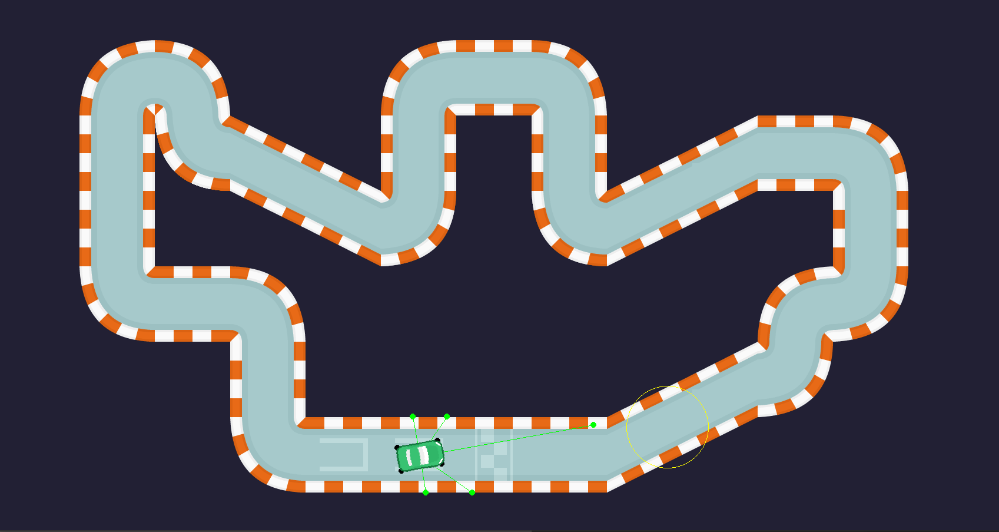

# Arcade racing game ai
Arcade racing game ai created using python and opengym ai  
r - toggle radars  
t - toggle hitboxes  
y - toggle checkpoints  
s - save q_table

# Tech Stack:
- python
- opengym ai

# Contributors
- milordmariusz
- pabasroka
- ArekStencel
- Streyter

## ScreenShots

